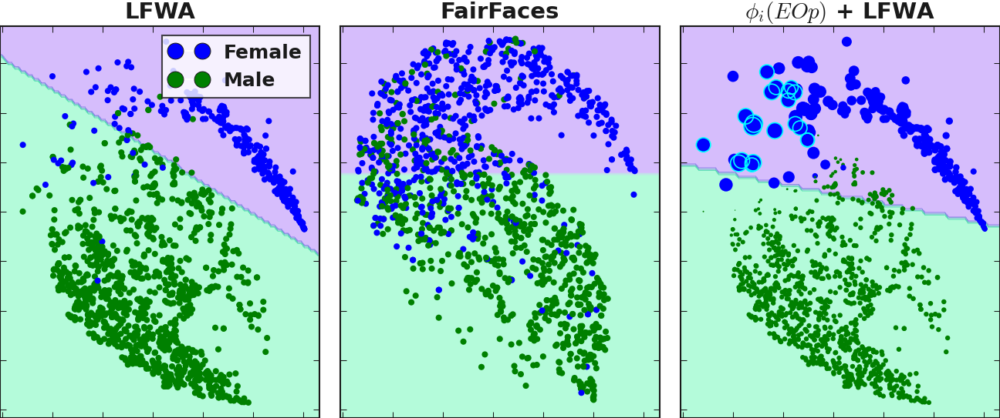

# Towards Algorithmic Fairness by means of Instance-level Data Re-weighting based on Shapley Values

***Adrian Arnaiz-Rodríguez, Nuria Oliver*** 

*(ELLIS Alicante)*

*DMLR @ ICLR'24*

Fair Data Valuation using Shapley Values for Algorithmic Fairness Re-weighting

```bibtex
@inproceedings{arnaiz2024fairshap,
title={Towards Algorithmic Fairness by means of Instance-level Data Re-weighting based on Shapley Values},
author={Arnaiz-Rodriguez, Adrian and Oliver, Nuria},
booktitle={ICLR 2024 Workshop on Data-centric Machine Learning Research (DMLR): Harnessing Momentum for Science},
year={2024},
url={https://openreview.net/forum?id=ivf1QaxEGQ}
}
```


## Implementation

* NumBa speed-up implementation:
```python
from fairSV.fair_shapley_sklearn import get_SV_matrix_numba_memory, get_sv_arrays

protected_attributes_dict = {'values':dataset_orig_valid.protected_attributes.ravel(),
                                             'privileged_protected_attribute': int(priv_attr),
                                             'unprivileged_protected_attribute': int(unpriv_attr),
                                             'favorable_label':int(fav_lab), 'unfavorable_label':int(unfav_lab)}


SV = get_SV_matrix_numba_memory(X_train, X_valid, y_train, y_valid) #SV Matrix
svs_acc, svs_eop, _, _ = get_sv_arrays(SV, y_valid, protected_attributes_dict, 'all')
```
`SV` refers to $\bm{\Phi}$ in the paper. `svs_acc, svs_eop`,... refers to the data valuation $\phi(.)$ for the given value function.

Then use them for your prefered goal: bias mitigation through re-weighting, data generation, exploratoty data analysis, data minimization, data acquisition policies...

### Re-weighting

```python
weights = sv_eop #choose prefered one
# use prefered normalization. We normalize such that the distribution of weights has mean 1 (they sum up to the number of training samples)
weights = (weights - weights.min())/(weights.max()-weights.min())
weights *= (N/weights.sum()) # N the number of training samples

model = GradientBoostingClassifier(random_state=seed)
model.fit(X_train, y_train, sample_weight=weights)
```


### Data Analysis

* Distribution of $\phi()$'s and weights (Section 4.1. experiment with images) 


* Embedding space exploration (Section 4.1. experiment with images) 



## Acknowledgments

*Funded by the European Union. Views and opinions expressed are however those of the author(s) only and do not necessarily reflect those of the European Union or the European Health and Digital Executive Agency (HaDEA). EU - HE ELIAS -- Grant Agreement 101120237. Funded also by Intel corporation, a nominal grant received at the ELLIS Unit Alicante Foundation from the Regional Government of Valencia in Spain (Convenio Singular signed with Generalitat Valenciana, Conselleria de Innovación, Industria, Comercio y Turismo, Dirección General de Innovación) and a grant by the Banc Sabadell Foundation.*


